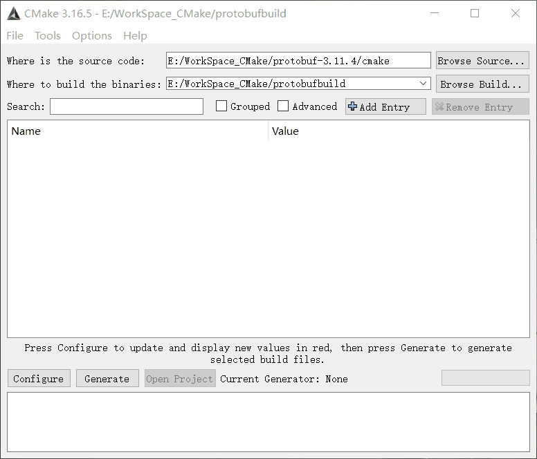

## 背景

俗话说“谷歌出品，必属精品”，想必大家都知道谷歌的protobuf。protobuf 是基础的数据格式，和 JSON、XML 非常的相似，都是用于存储结构化的数据，都支持很多不同的语言使用并进行序列化和反序列化。

由于平时项目中也有用到protobuf，但一般都在windows下用VisualStudio编译使用，这次想做一个编译版本，使之能支持项目跨平台，既然提到跨平台了，作为一个C++在线脱发程序员，霸王洗发液忠实粉丝，自然而然就想到Qt了（什么？我都想到Qt了你还在问我有没有头发？），用Qt做跨平台项目那编译器自然是选择MinGW了。尽管路线明确，可是在实际的编译静态链接库的过程还是错误百出......

如果你跟我一样，想在Windows上使用Qt的MinGW编译protobuf的静态库，那就继续往下看吧，你要踩的坑我已经踩过了！

## 工具与材料

- [protobuf源码](https://github.com/protocolbuffers/protobuf/tags)(选一个心仪的版本下载)
- [Qt5](http://download.qt.io/archive/qt/)及以上（据我所知最后一个支持xp的Qt版本是5.5.1，面向xp编程的盆友可以注意一下）
- [CMake](https://cmake.org/download/)(如果下载的protobuf源码包解压后在protobuf-x.x.x目录中有cmake目录则安装此项，如果没有cmake目录，则跳过此项直接安装下面的msys)
- [msys](http://sourceforge.net/projects/mingwbuilds/files/external-binary-packages/ )（下载msys+7za+wget+svn+git+mercurial+cvs-rev13.7z这种名称的压缩包）

## 工具的安装及配置

### Qt的安装

Windows平台下注意安装Qt时要勾选Qt/Qt5.x.x/MinGWx.x.x 32(64)bit和Tools/MinGW 5.x.x

安装完后要配置环境变量

```she
#比如我的（以下环境变量，无则创建，有则追加）
C_INCLUDE_PATH  D:/Qt/Qt5.12.7/Tools/mingw730_64/include
LIBRARY_PATH    D:/Qt/Qt5.12.7/Tools/mingw730_64/lib
PATH            D:/Qt/Qt5.12.7/Tools/mingw730_64/bin
```

配置完成后可以打开cmd敲以下gcc -v命令，看看有没有输出版本信息，有输出就证明配置正确了

### CMake的安装

下载合适的安装包安装即可

### msys的安装

将下载的压缩包解压到解压到MinGW目录下，比如我将解压出的msys目录放到了D:/Qt/Qt5.12.7/Tools/mingw730_64目录下

## 编译

编译分两种，是protobuf情况而定，这也是选择性的安装msys和CMake的原因，如果下载的protobuf源码包解压后在protobuf-x.x.x目录中有cmake目录则用CMake，如果没有cmake目录，则用msys。

- CMake方式

  - 任意一处创建一个目录作为编译后生成文件的存放目录（比如我的叫protobufbuild）
  - 打开安装好的CMake选择相应的目录和选项进行如图操作

  

  - 打开protobufbuild目录执行mingw32-make.exe命令并回车即可开始编译，编译后的文件都在该目录下

  

- msys方式 

  进入msys目录，打开双击运行msys.bat

  ```shell
  ./configure --prefix 目标生成目录绝对路径
  make
  make install
  ```

  在目标目录即可看到生成的静态库和相应程序

  libprotobuf.a

  libprotobuf-lite.a

  protoc.exe

  

## 结束语

protobuf的具体使用方法就不说了，使用时注意引入库文件就好了和静态库就好了

